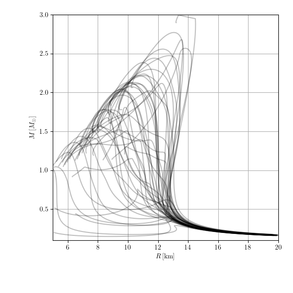

The following provides a brief summary of the impact of several modeling choices made when constructing prior processes for EoS extensions to high densities based on tabular data from [arXiv:2204.14016](https://arxiv.org/abs/2204.14016).
Specifically, we test the following

  * the exact method by which the EFT is "stitched" to the crust
    - we use a fixed BPS crust at low densities
  * the amount the EoS is allowed to "wiggle" within the EFT band
  * the order up to which the EFT calculation is conducted
    - N2LO vs N3LO, with estimates of uncertainty based on the maximum difference observed between consecutive orders
    - the regulator scheme and the cut-off momentum are kept fixed
 
--------------------------------------------------

## Construction of Gaussian process extensions

### read in tabular data

First, we numerically estimate `cs2c2` from `pressurece2` and `energy_densityc2` and then compute `phi` as a function of `log(pressurec2)`.
This is done for the mean, min, and max estimates from the EFT calculation.

### construct GP model for the EFT band

We construct a GP for `phi(log(pressurec2))` with

  * mean given by `phi` of the mean from the tabular data
  * marginal variance set to approximately reproduce the spread between the min and max `phi` in the tabular data

The covariance kernel is defined as
```math
    C_{ij} = s^2 \sigma(x_i) \sigma(x_j) \exp(-(x_i - x_j)^2 / l^2)
```
where `sigma(x_i)` is set by the observed spread in the tabular data at `x_i`. There are two free parameters in this kernel

  * `s` : an overall scale to control how much variance there is
  * `l` : a correlation length determining how much the curves can wiggle within this band

### stitch the GP model for the EFT band to the crust

We implement two methods to stitch the EFT band to the crust

  * "switching" when the crust's sound speed crosses the sound speed of the mean from the EFT prediction
    - the uncertainty is "damped" below this matching point according to a half-cosine (modulates the marginal variance). This forces all realizations to closely follow the crust
    - there are several free parameters in this procedure
      * `delta_logpc2` : controls the distance over which the half-cosine opperates
      * `pow` : controls how much more the marginal variance is forced to shrink at pressures below `logpc2_match - delta_logpc2`
  * "conditioning" the EFT bands on the crust through standard GP regression.
    - the crust may be truncated to only be below a user-specified maximum baryon density
    - the crust is also modeled as having a small white-noise uncertainty to help with numerical stability
    - there are several free parameters in this procedure
      * `sigma_crust` : the size of a the standard deviation for a white-noise kernel that is added to the crust

### condition an agnostic extension to match the EFT+crust process

We follow the process described [here](https://github.com/reedessick/universality/blob/master/notes/fix-marginal.pdf).

### draw realizations and solve the TOV equations

There is an additional step that actually stitches the GP realization to a crust. However, this is done at very low densities, well below where we make the GP closely follow the crust in the previous steps.

--------------------------------------------------

## Impact of stitching method

The following examples show the impact of stitching choices on the distribution of macroscopic properties of NSs.

I show the results for the N3LO EFT data with `s=0.75`, `l=1.00`, and extensions to higher densities loosely based on hadronic EoS.
These models trust the EFT calculation up to `~1.5*nsat` (`p/c2 = 1e13 g/cm^3`).

|                      |switching to crust near `0.25*nsat`|conditioning on crust up to `0.25*nsat`|conditioning on crust up to `0.50*nsat`|
|----------------------|-----------------------------------|---------------------------------------|---------------------------------------|
|EFT GP construction   ||||
|ext. to high density  ||||
|sound-speed vs density||||
|pressure vs density   ||||
|mass vs radius        ||||

--------------------------------------------------

## Impact of "wiggles" within EFT band

The following examples show the impact of wiggles in `cs2c2` within the EFT band. As described at length in, e.g., [arXiv:2004.07232](https://arxiv.org/abs/2004.07232), we expect the uncertainty in the EFT calculation to be correlated across densities. However, the bands from [arXiv:2204.14016](https://arxiv.org/abs/2204.14016) do not account for any such correlation. We investigate whether the presence of wiggles in the sound speed (that are still bounded within the EFT band) have a significant impact on macroscopic properties of NSs. See also discussion in [arXiv:2305.07411](https://arxiv.org/abs/2305.07411) and references therein.

Below, I show the results of the "switch" stitching to the crust and extensions to higher densities loosely based on hadronic EoS.
These models trust the EFT calculation up to `~1.5*nsat` (`p/c2 = 1e13 g/cm^3`).

|                      |many wiggles: `s=1.00` & `l=0.25`|some wiggles: `s=0.75` & `l=1.00`|no wiggles: `s=0.75` & `l=4.00`|
|----------------------|---------------------------------|---------------------------------|-------------------------------|
|GP construction       |
|sound-speed vs density|
|pressure vs density   |
|mass vs radius        |

--------------------------------------------------

## Impact of the order of the EFT calculation

Finally, we compare the uncertainty in macroscopic properties of NSs with conditioned on different orders in the EFT calculation at low densities.

I show the results of the "switch" stitching to the crust, some wiggles (`s=0.75` & `l=1.00`), and extensions to higher densities loosely based on hadronic EoS.
These models trust the EFT calculation up to `~1.5*nsat` (`p/c2 = 1e13 g/cm^3`).

|                      |N2LO|N3LO|
|----------------------|----|----|
|GP construction       |
|sound-speed vs density|
|pressure vs density   |
|mass vs radius        |

