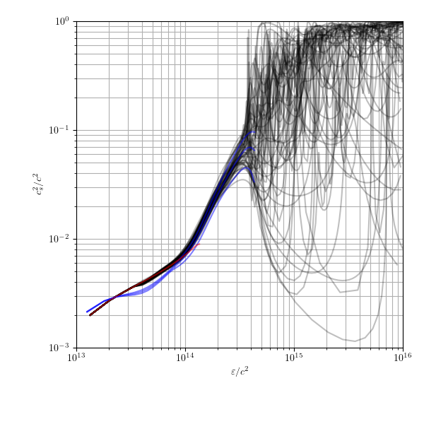
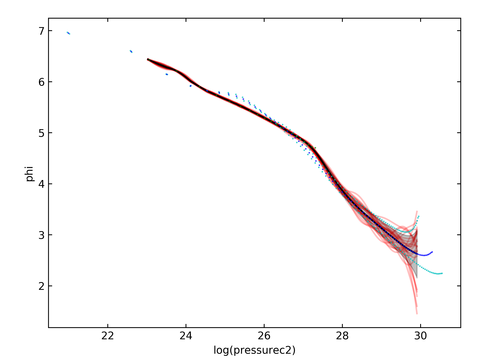
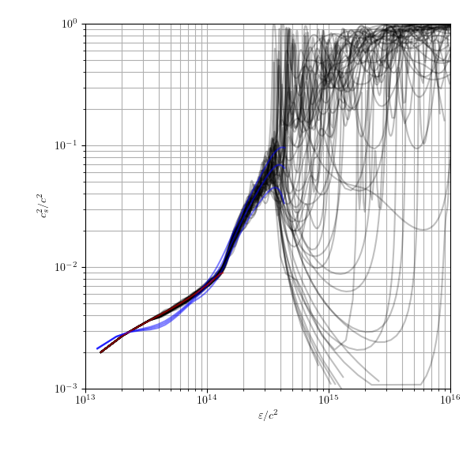
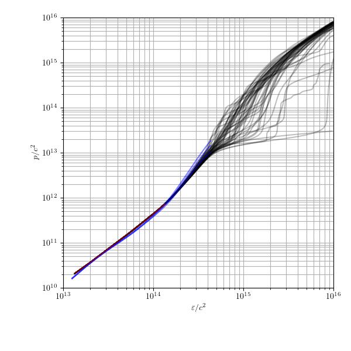
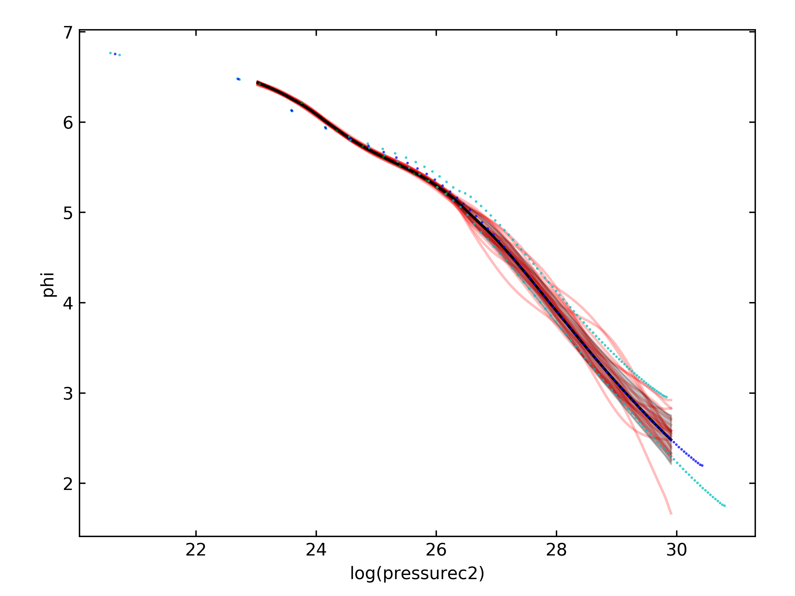
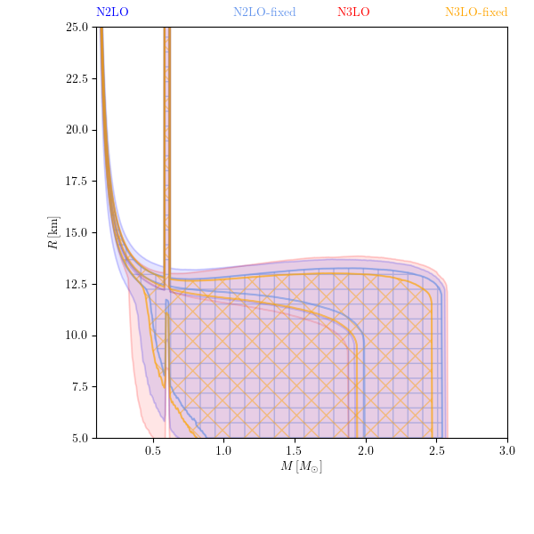

# Impact of modeling choices when extending Chiral Effective Field Theory calculations to higher (and lower) densities

The following provides a brief summary of the impact of several modeling choices made when constructing prior processes for EoS extensions to high densities based on tabular data from [arXiv:2204.14016](https://arxiv.org/abs/2204.14016).
Specifically, we test the following

  * the exact method by which the EFT is "stitched" to the crust
    - we use a fixed BPS crust at low densities
  * the amount the EoS is allowed to "wiggle" within the EFT band
  * the order up to which the EFT calculation is conducted
    - N2LO vs N3LO, with estimates of uncertainty based on the maximum difference observed between consecutive orders
    - the regulator scheme and the cut-off momentum are kept fixed
 
--------------------------------------------------

## Construction of Gaussian process extensions

We construct extended models of the EFT predictions with the following procedure.

### 1) read in tabular data

First, we numerically estimate `cs2c2` from `pressurece2` and `energy_densityc2` and then compute `phi` as a function of `log(pressurec2)`.
This is done for the mean, min, and max estimates from the EFT calculation.

### 2) construct GP model for the EFT band

We construct a GP for `phi(log(pressurec2))` with

  * mean given by `phi` of the mean from the tabular data
  * marginal variance set to approximately reproduce the spread between the min and max `phi` in the tabular data

The covariance kernel is defined as
```math
    C_{ij} = s^2 \sigma(x_i) \sigma(x_j) \exp(-(x_i - x_j)^2 / l^2)
```
where `sigma(x_i)` is set by the observed spread in the tabular data at `x_i`. We also impose a lower limit on `sigma(x_i)` to keep it from becoming so small that it affects numerical stability (`sigma >= 5e-2`). There are two free parameters in this kernel

  * `s` : an overall scale to control how much variance there is
  * `l` : a correlation length determining how much the curves can wiggle within this band

### 3) stitch the GP model for the EFT band to the crust

We implement two methods to stitch the EFT band to the crust

  * "switching" when the crust's sound speed crosses the sound speed of the mean from the EFT prediction
    - the uncertainty is "damped" below this matching point according to a half-cosine (modulates the marginal variance). This forces all realizations to closely follow the crust
    - there are several free parameters in this procedure
      * `delta_logpc2` : controls the distance over which the half-cosine opperates
      * `pow` : controls how much more the marginal variance is forced to shrink at pressures below `logpc2_match - delta_logpc2`
  * "conditioning" the EFT bands on the crust through standard GP regression.
    - the crust may be truncated to only be below a user-specified maximum baryon density
    - the crust is also modeled as having a small white-noise uncertainty to help with numerical stability. This grows with pressure (the crust is less certain at higher pressures): `cov[i,i] = sigma_curst**2 * (p[i]/p[-1])**pow`
    - there are several free parameters in this procedure
      * `sigma_crust` : the size of a the standard deviation for a white-noise kernel that is added to the crust
      * `sigma_pow` : how the white noise scales with pressure

### 4) condition an agnostic extension to match the EFT+crust process

We follow the process described [here](https://github.com/reedessick/universality/blob/master/notes/fix-marginal.pdf).
Within this procedure, we use a relatively long "smoothing length" (`5.0`) and a small "smoothing sigma" (`0.01`).

The model-agnostic extensions to high densities are similar to those defined in [arXiv:1910.09740](https://arxiv.org/abs/1910.09740) and subsequently used in [arXiv:2004.07744](https://arxiv.org/abs/2004.07744), [arXiv:2102.10074](https://arxiv.org/abs/2102.10074), and [arXiv:2107.05528](https://arxiv.org/abs/2107.05528) among others.

### draw realizations and solve the TOV equations

There is an additional step that actually stitches the GP realization to a crust. However, this is done at very low densities (`pressurec2 = 1e11 g/cm^3`), well below where we make the GP closely follow the crust in the [previous steps](#3-stitch-the-gp-model-for-the-eft-band-to-the-crust).

--------------------------------------------------

## Impact of stitching method

The following examples show the impact of stitching choices on the distribution of macroscopic properties of NSs.

I show the results for the N3LO EFT data with `s=0.75`, `l=1.00`, and extensions to higher densities loosely based on hadronic EoS.
These models trust the N3LO EFT calculation up to `~1.5*nsat` (`p/c2 = 1e13 g/cm^3`).

|                      |switching to crust near `0.25*nsat`|conditioning on crust up to `0.25*nsat`|conditioning on crust up to `0.50*nsat`|
|----------------------|-----------------------------------|---------------------------------------|---------------------------------------|
|EFT GP construction   ||||
|ext. to high density  ||||
|sound-speed vs density||||
|||||
|pressure vs density   ||||
|||||
|mass vs radius        ||||
|||||

### Observations

Conditioning the GP model of the EFT band on the crust can lead to some unwanted features. For example, the relatively long correlation lengths assumed within the EFT band can mean that the resulting process "misses" the EFT band over a large pressure range.

While, "switching" to the crust can produce a more controled transition that consistently follows the EFT band over the entire range of pressures considered, so does conditioning on the crust at a lower density (`0.25*nsat` vs `0.50*nsat`).

Nonetheless, the impact of these choices on the M-R curves appears to be relatively small, unless the conditiond mean does something really wacky.

--------------------------------------------------

## Impact of "wiggles" within EFT band

The following examples show the impact of wiggles in `cs2c2` within the EFT band. As described at length in, e.g., [arXiv:2004.07232](https://arxiv.org/abs/2004.07232), we expect the uncertainty in the EFT calculation to be correlated across densities. However, the bands from [arXiv:2204.14016](https://arxiv.org/abs/2204.14016) do not account for any such correlation. We investigate whether the presence of wiggles in the sound speed (that are still approximately bounded within the EFT band) have a significant impact on macroscopic properties of NSs. See also discussion in [arXiv:2305.07411](https://arxiv.org/abs/2305.07411) and references therein.

Below, I show the results of the "condition near `0.5*nsat`" stitching to the crust and extensions to higher densities loosely based on hadronic EoS.
These models trust the N3LO EFT calculation up to `~1.5*nsat` (`p/c2 = 1e13 g/cm^3`).

|                      |many wiggles: `s=1.00` & `l=0.25`|some wiggles: `s=1.00` & `l=0.50`|no wiggles: `s=0.75` & `l=2.00`|
|----------------------|----------------------------------|----------------------------------|-------------------------------|
|GP construction       ||||
|ext. to high density  ||||
|sound-speed vs density||||
|||||
|pressure vs density   ||||
|||||
|mass vs radius        ||||
|||||

### Observations

Allowing for many wiggles within the EFT band appears to come close to numerical stability issues when transitioning to the high-density agnostic model (large marginal variances), but overall seems reasonable. There appear to be no catastrophic failures of the model when we allow for there to be many wiggles within the EFT band.

*However*, there is an important difference in the pressure vs density (and therefore mass vs radius) curves. When we allow there to be many wiggles in `cs2c2`, they tend to "average out" in the pressure vs. density. That is, the resulting set of curves for the pressure vs density tend to more closely follow the mean (a tighter distribution). As a consequence, the distribution of mass vs radius curves is also tighter.

This behavior can be understood as an averaging process. If we consider a model in which the sound speed is completely uncorrelated from one density to the next, then each little density region will be a separate (independent) trial. When we integrate the sound speed to obtain the pressure, we *de facto* sum over many such trials. The distribution of that sum will be tightly constrained around the mean, with a spread set by the intrinsic spread of the individual sound-speed realizations and the effective number of trials (how many wiggles are allowed).

The issues with conditioning on the crust up to high densities (`0.5*nsat`) with a long correlation length (`l=2.00`) are more apparent as well. In this case, they lead to systematically softer EoS (lower `cs2c2`).

--------------------------------------------------

## Impact of the order of the EFT calculation

Finally, we compare the uncertainty in macroscopic properties of NSs with conditioned on different orders in the EFT calculation at low densities.

I show the results of the "condition at `0.25*nsat`" stitching to the crust, some wiggles (`s=0.75` & `l=1.00`), and extensions to higher densities loosely based on hadronic EoS.
These models trust the each EFT calculation up to `~1.5*nsat` (`p/c2 = 1e13 g/cm^3`).

|                      |N2LO|N3LO|
|----------------------|----|----|
|GP construction       |||
|ext. to high density  |||
|sound-speed vs density|||
||||
|pressure vs density   |||
||||
|mass vs radius        |||
||||

### confidence regions

Below, I show 50% and 90% symmetric credible regions for R(M) and Lambda(M) as a function of M derived from each process that conditions on the BPS crust up to `0.25*nsat`" and has plenty of wiggles (`s=1.00` & `l=0.50`).




**Add estimates of credible regions for these processes**

  * `p(rho)`?
  * `cs2c2(rho)`?

### Observations

As expected, the higher-order calculation has a smaller uncertainty in the sound-speed within the EFT band. This translates to a smaller uncertainty in pressure vs. density and a smaller spread in mass vs radius.

*However*, the extension to high densities can still probe roughly equivalent parts of the mass-radius plane. It would likely take many more draws from these prior processes to confidently distinguish between them at high densities. [arXiv:2004.07744](https://arxiv.org/abs/2004.07744) suggests that tighter constraints at low densities may translate into tighter constraints at high densities, but the improvements in the constraints at low densities between the N2LO and N3LO calculations may be too small to become immediately apparent. With the limited sample sample size drawn here, we do see slightly larger `R(1.4)` with N2LO than with N3LO, but we may also need to include astrophysical data before these differences more clearly appear.

It does appear that our stitching logic produces slightly wider uncertainties at the lowest densities for N2LO compared to N3LO. This will naturally manifest in the pressure vs density and mass vs radius planes. However, given that we see very little impact from the precise way the N3LO bands are stitched to the crust, the additional uncertainty in the N2LO process is probably not only due to this additional uncertainty at very low densities. The extra spread between `0.5*nsat` to `1.5*nsat` likely dominates.
